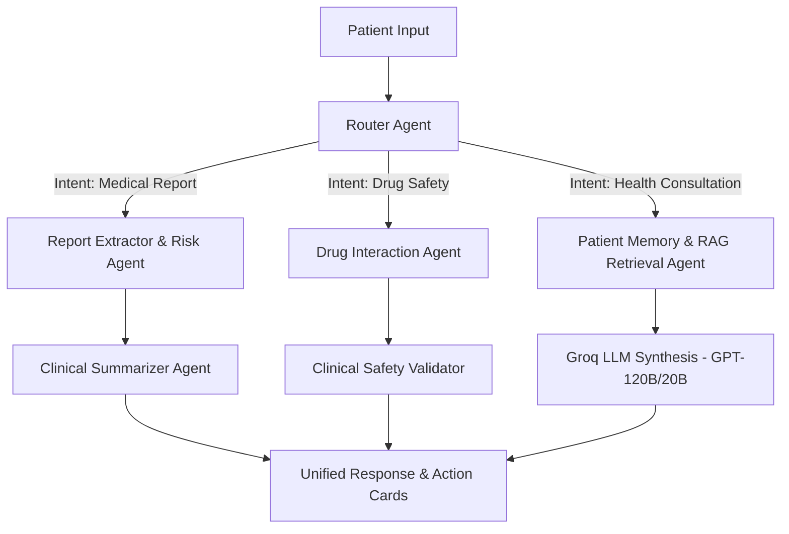

# 🩺 Nura - AI-Powered Healthcare Assistant Platform

[](https://vercel.com)
[](https://render.com)
[](https://fastapi.tiangolo.com)
[](https://nextjs.org)
[](https://www.mongodb.com/cloud/atlas)
[](https://qdrant.tech)

**Nura** is an enterprise-grade, AI-powered healthcare assistant platform designed to empower patients, doctors, and healthcare administrators. Built with a production-ready **LangGraph Multi-Agent AI system**, Nura delivers clinical report analysis, medical risk assessment, drug-drug interaction safety validation, appointment scheduling with automated Google Meet links, escrow payments, and longitudinal patient health insights.

---

## 🏗️ Tech Stack

### **Frontend**
- **Framework:** Next.js 15 (App Router) + React 19 + TypeScript
- **Styling:** Vanilla CSS + Tailwind CSS + Lucide Icons
- **State Management:** Zustand + TanStack Query v5 (React Query)
- **UI & UX:** Modern Glassmorphism, Responsive Dark/Light System, Interactive Micro-animations, React Hot Toast
- **Deployment:** Vercel

### **Backend**
- **Framework:** FastAPI 0.116.1 + Python 3.13 / 3.11 + Uvicorn 0.35.0
- **Primary Database:** MongoDB Atlas (Async Motor 3.7.1)
- **Vector Database:** Qdrant Cloud (qdrant-client 1.19.0)
- **AI & LLM Orchestration:** Groq API (`openai/gpt-oss-120b`, `openai/gpt-oss-20b`), Sentence-Transformers (`BAAI/bge-small-en-v1.5`)
- **Authentication:** JWT (HS256) + Google OAuth 2.0
- **Storage Provider:** Supabase Storage (Buckets: `avatars`, `reports`, `doctor-documents`) with local fallback
- **Payments:** Razorpay Escrow Integration
- **Integrations:** Google Calendar & Google Meet API
- **Deployment:** Render (Web Service)

---

## ✨ Key Features

### 👨‍⚕️ 1. Patient Health Portal
- **Intelligent Healthcare Chat:** Real-time multi-agent conversational AI assistant powered by Groq LLM and vector RAG context.
- **Medical Report Extraction & Analysis:** Upload PDF/image lab reports; automated OCR extraction, clinical entity detection, risk scoring, and patient-friendly summaries.
- **Drug Safety & Interaction Engine:** Check medication safety, contraindications, and drug-drug interactions using deterministic DDInter data.
- **Appointment Booking:** Browse verified doctors, select consultation slots, execute escrow payments, and join auto-generated Google Meet calls.
- **Reminders & Tracking:** Daily/weekly medication and health checkup reminders.

### 👩‍⚕️ 2. Doctor Dashboard & Consultations
- **Clinical Consultations Management:** View upcoming patient appointments, approve/reject requests, set consultation fees, and access one-click Google Meet video links.
- **Patient Longitudinal Records:** Inspect structured medical histories, past report summaries, and AI risk evaluations before consultations.
- **Doctor Verification System:** Document submission (license, credentials) to Supabase Storage with admin verification workflow.
- **Wallet & Earnings:** Track consultation revenue with escrow release on completion.

### 🛡️ 3. Administrative Control Platform
- **System Monitoring & Health:** Real-time platform telemetry, database status, background worker queues, and RAG retrieval latency benchmarks.
- **User & Doctor Management:** Verify doctor profiles, toggle account statuses, manage permissions, and bootstrap platform admins securely.
- **Audit Logging:** System-wide audit logs tracking critical actions.

---

## 🚀 Quick Start & Local Setup

### Prerequisites
- **Node.js**: `v20.0.0` or higher
- **Python**: `3.11+` or `3.13+`
- **MongoDB Atlas** account & connection string
- **Qdrant Cloud** vector database account
- **Groq API** key
- **Supabase** project (Storage buckets: `avatars`, `reports`, `doctor-documents`)

---

### Backend Setup

1. **Navigate to the backend directory:**
   ```bash
   cd backend
   ```

2. **Create and activate a Python virtual environment:**
   ```bash
   # Windows
   python -m venv venv
   venv\Scripts\activate

   # macOS/Linux
   python3 -m venv venv
   source venv/bin/activate
   ```

3. **Install backend dependencies:**
   ```bash
   pip install -r requirements.txt
   ```

4. **Configure environment variables:**
   ```bash
   cp .env.example .env
   # Edit .env with your local credentials (MongoDB, Qdrant, Groq, Supabase, etc.)
   ```

5. **Run the backend server:**
   ```bash
   python run.py
   # OR
   uvicorn app.main:app --reload --host 0.0.0.0 --port 8000
   ```
   - **API Docs:** `http://localhost:8000/docs`
   - **Health Endpoint:** `http://localhost:8000/api/v1/health`

---

### Frontend Setup

1. **Navigate to the frontend directory:**
   ```bash
   cd frontend
   ```

2. **Install Node.js dependencies:**
   ```bash
   npm install
   ```

3. **Configure environment variables:**
   ```bash
   cp .env.local.example .env.local
   # Set NEXT_PUBLIC_API_URL=http://localhost:8000/api/v1
   ```

4. **Start the Next.js development server:**
   ```bash
   npm run dev
   ```
   - **Frontend Application:** `http://localhost:3000`

---

## 🌐 Production Deployment

The project is configured for seamless zero-downtime deployment:
- **Frontend**: Deployed on **Vercel** (Root: `frontend`)
- **Backend**: Deployed on **Render** (Root: `backend`, Command: `uvicorn app.main:app --host 0.0.0.0 --port $PORT`)

📖 **Complete Deployment & Environment Switching Instructions:** Refer to **[docs/DEPLOY.md](docs/DEPLOY.md)** for step-by-step guides on configuring Vercel, Render, environment variables, CORS, and switching between local and server environments.

---

## 🤖 Multi-Agent AI System Architecture

Nura leverages a state-of-the-art multi-agent framework designed for clinical accuracy and domain boundary safety:



---

## 🚀 Future Scope & Roadmap

As Nura continues to evolve, the following major architectural enhancements are scheduled for upcoming releases:

### 💬 1. Real-Time Interactive Chat & Streaming System
- **Bidirectional WebSockets / SSE**: Upgrading chat infrastructure from HTTP polling to full duplex WebSockets for sub-millisecond response latency.
- **Agent Thinking Indicators**: Real-time visual feedback showing multi-agent reasoning steps (e.g. *Retrieving medical history...*, *Analyzing drug interaction...*, *Evaluating clinical risk...*).
- **Voice & Multimodal Inputs**: Audio recording and speech-to-text integration for hands-free patient voice queries and doctor dictation.

### ⚡ 2. Redis Distributed Caching & Message Broker Layer
- **High-Performance Session Caching**: Offloading user JWT session states, auth tokens, and active chat session memory buffers to Redis for microsecond lookup times.
- **LLM & RAG Semantic Caching**: Caching vector search queries and Groq LLM response summaries to reduce API latency and optimize token costs.
- **Distributed Rate Limiting**: Enforcing IP and user-based API rate limits across scalable server instances.
- **Task Broker**: Powering asynchronous task processing (large PDF OCR pipelines, batch report extractions) using Redis with Celery / ARQ workers.

### 🔔 3. Comprehensive Multi-Channel Notification Engine
- **In-App Real-Time Toasts**: Instant WebSocket notifications for appointment approvals, doctor messages, and report processing completion.
- **Email & SMS Reminders**: Automated SMTP/Brevo email & Twilio SMS alerts for upcoming doctor appointments, missed medication dosages, and vital checkups.
- **High-Risk Clinical Alerts**: Automatic emergency warnings sent to patients and assigned care teams when abnormal lab report findings or severe drug interactions are detected.

---

## 📁 Repository Structure

```text
nura/
├── backend/
│   ├── app/
│   │   ├── api/v1/          # FastAPI REST endpoints (auth, users, doctors, reports, chat, admin, etc.)
│   │   ├── core/            # Config, security, JWT, AI settings
│   │   ├── db/              # MongoDB Async motor client & Qdrant vector client
│   │   ├── models/          # MongoDB Pydantic models
│   │   ├── schemas/         # Request & Response API schemas
│   │   ├── services/        # Core business logic, multi-agent orchestrator, RAG, Supabase storage
│   │   └── utils/           # Helper utilities
│   ├── Dockerfile           # Backend container specification
│   ├── requirements.txt     # Python dependencies
│   └── run.py               # Backend startup script
│
├── frontend/
│   ├── src/
│   │   ├── app/             # Next.js 15 App Router pages & API routes
│   │   ├── components/      # UI components & layouts
│   │   ├── hooks/           # Custom React hooks (TanStack Query)
│   │   ├── lib/             # Axios client, auth helpers, utility functions
│   │   ├── services/        # Frontend API services
│   │   └── stores/          # Zustand global state stores
│   ├── Dockerfile           # Frontend container specification
│   └── package.json         # Node.js dependencies
│
└── docs/                    # Architecture & Deployment Documentation
    ├── DEPLOY.md            # Detailed Vercel & Render Deployment Guide
    ├── SETUP.md             # Developer Setup Guide
    ├── ARCHITECTURE_DECISIONS.md # Architecture Decision Records (ADRs)
    ├── API_CONTRACT.md      # API Endpoints Specification
    └── ENVIRONMENT_VARIABLES.md # Complete Environment Variables Guide
```

---

## 📚 Documentation Index

For full technical specifications, architecture decisions, and operational guides:
- 📖 **[Deployment Guide](docs/DEPLOY.md)**
- ⚙️ **[Developer Setup Guide](docs/SETUP.md)**
- 🔑 **[Environment Variables Guide](docs/ENVIRONMENT_VARIABLES.md)**
- 📐 **[Architecture Decisions (ADRs)](docs/ARCHITECTURE_DECISIONS.md)**
- 🔌 **[API Contract & Specifications](docs/API_CONTRACT.md)**

---

## 📄 License & Support

This project is proprietary and confidential.

For technical questions or support, review the documentation in the [`/docs`](docs/) directory or check the interactive API documentation at `/docs` when the backend server is running.

---

**Nura - Intelligent Healthcare Companion** 🩺
