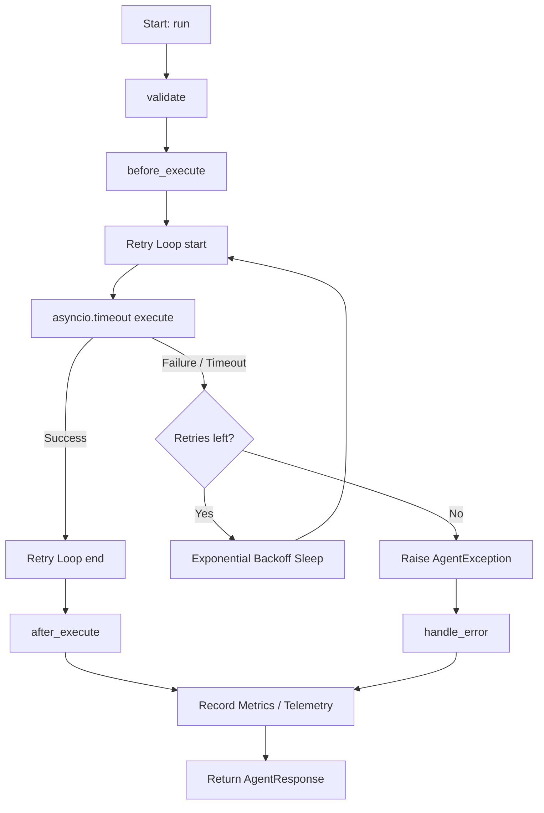

# Nura AI Agent Framework

The Nura Agent Framework provides a standardized, production-ready class hierarchy and execution lifecycle that every future AI agent in the Nura platform inherits from. It handles telemetry tracking, retry boundaries, exception translation, logging restrictions, and tool bindings with minimal boilerplate.

---

## Architecture Overview

All agent modules are located under `backend/app/agents/`:
```text
backend/app/agents/
│
├── base/
│   ├── base_agent.py        # Core lifecycle execution flow
│   ├── retrieval_agent.py   # Data and vector query hooks
│   ├── memory_agent.py      # Patient and conversational memory abstractions
│   ├── tool.py              # Extensible tool bindings
│   ├── response.py          # Unified response schemas
│   ├── context.py           # Trace context definitions
│   ├── exceptions.py        # Custom framework exceptions
│   └── __init__.py
│
└── __init__.py
```

---

## 1. BaseAgent Lifecycle

`BaseAgent` is an abstract class managing execution parameters. It wraps operations inside the `run()` coordinator, which runs the following hooks:

1. **`validate(input_data, context)`**:
   - Guard checks on input payload shapes (verifies non-empty structures).
   - Inherited classes override this to check specific payload structures.
2. **`before_execute(input_data, context)`**:
   - Setup hook run before execution begins (e.g. pre-allocating metadata).
3. **`execute(input_data, context)`**:
   - **Abstract Core Method**: Every subclass **must** override this to implement its specific AI logic.
   - Automatically wrapped with **timeouts** and **exponential retries** loaded from `AISettings`.
4. **`after_execute(response, context)`**:
   - Post-processing hook to modify the response metadata before returning it.
5. **`handle_error(error, context)`**:
   - Error routing translating raw exceptions to standard `AgentResponse` structures.



---

## 2. Agent Inheritance

To write a new agent (e.g., Symptom Agent, Reminder Agent), inherit from `BaseAgent` and override `execute()`:

```python
from app.agents import BaseAgent, AgentContext, AgentResponse

class SymptomAgent(BaseAgent):
    def __init__(self):
        super().__init__(name="Symptom Agent")

    async def execute(self, input_data: str, context: AgentContext) -> dict:
        # Perform custom logic (call LLM, query patient data, etc.)
        # Return a dictionary or AgentResponse
        return {
            "response": f"Analyzed symptoms for: {input_data}",
            "citations": ["database://patient/symptoms"],
            "metadata": {"risk_level": "low"}
        }
```

---

## 3. AgentContext

The `AgentContext` container provides telemetry and request metadata propagation. Every agent caller passes this down:

- `user_id` (str): Authenticated caller ID.
- `patient_id` (str): Target patient profile ID.
- `doctor_id` (str): Active doctor profile ID.
- `session_id` (str): Active WebSocket/API session trace.
- `request_id` (str): Unique request identifier.
- `role` (str): Scope roles (`admin`, `doctor`, `patient`).
- `conversation_id` (str): Historical chat trace index.
- `metadata` (dict): Custom key-value variables.

---

## 4. AgentResponse

All agents return the uniform `AgentResponse` Pydantic schema:

- `success` (bool): True if completed without unhandled exceptions.
- `message` (str): Status description text.
- `response` (Any): Output payload (string, dict, list).
- `citations` (List[str]): Source references.
- `metadata` (dict): Custom key-value response variables.
- `usage` (dict): Token metrics breakdown (`prompt_tokens`, `completion_tokens`, `total_tokens`).
- `execution_time` (float): Total duration latency in milliseconds.
- `agent_name` (str): Executor identifier name.

---

## 5. Tool Abstraction

Future agent tools (e.g., calendar schedule, database lookups, payment processing) inherit from `Tool`:

```python
from app.agents import Tool
from typing import Dict, Any

class ScheduleAppointmentTool(Tool):
    async def execute(self, doctor_id: str, slot: str) -> bool:
        # Core execution logic
        return True

    def validate(self, doctor_id: str, slot: str) -> bool:
        return bool(doctor_id and slot)

    def metadata(self) -> Dict[str, Any]:
        return {
            "name": "schedule_appointment",
            "description": "Schedule a medical consultation slot",
            "parameters": {
                "doctor_id": "str",
                "slot": "str"
            }
        }
```

---

## 6. Telemetry & Logging Rules

To comply with HIPAA and security directives:
- **Metrics**: Automatically records latency, timeouts, execution totals, and token counts in the global `agent_metrics` singleton.
- **Privacy Boundary**: Custom structured logs include metadata (agent name, latencies, status) but **never** record prompt templates, input prompts, medical texts, clinical reports, or raw AI completions.

---

## 7. Context Assembly Integration

Agents that require clinical patient context or external domain knowledge (such as the Symptom Agent, Medical Knowledge Agent, or Chatbot) should not query Qdrant or MongoDB directly. Instead, they must invoke the `ContextAssemblyService` to construct token-safe, prioritized prompts:

1. **Context Initialization**: Retrieve the `patient_id` from the `AgentContext` object.
2. **Context Compilation**: Call `context_assembly_service.build_context(...)` with:
   - The user's semantic `query`
   - Target `patient_id`
   - Configured `token_budget` (tailored to the LLM model context window limit)
3. **Structured Response Formatting**: Use the returned citation lookup map to generate verified responses, matching generated citations back to the structured `citations` field in the final `AgentResponse`.

---

## 8. Concrete Retrieval Agent

Implemented in Phase 9 - Sprint 4, `RetrievalAgent` is the first concrete implementation of the base agent classes:
- **Base Agent Class**: `RetrievalAgent` inherits from `app.agents.base.retrieval_agent.RetrievalAgent` (which inherits from `BaseAgent`).
- **Execution Workflow**:
  1. Validates input query text.
  2. Resolves patient metadata from `AgentContext`.
  3. Invokes `IntentDetectionService` to determine the category (e.g. `medical_question`, `report_analysis`, etc.) and target collections.
  4. Checks the `RetrievalCache` for matching queries (unless `bypass_cache` is set in the metadata).
  5. Performs vector search across mapped collections via `RetrievalService`.
  6. Assembles the token-bounded context via `ContextAssemblyService`.
  7. Formats the outputs into a standard `RetrievalPackage` structure.
  8. Tracks execution metrics using `RetrievalAgentMetricsTracker`.
- **TTL Cache Mechanism**: Implements `RetrievalCache` using an in-memory dictionary with a TTL based on `RETRIEVAL_CACHE_TTL`. Keys are generated deterministically from patient ID, normalized query text, and detected intent.

