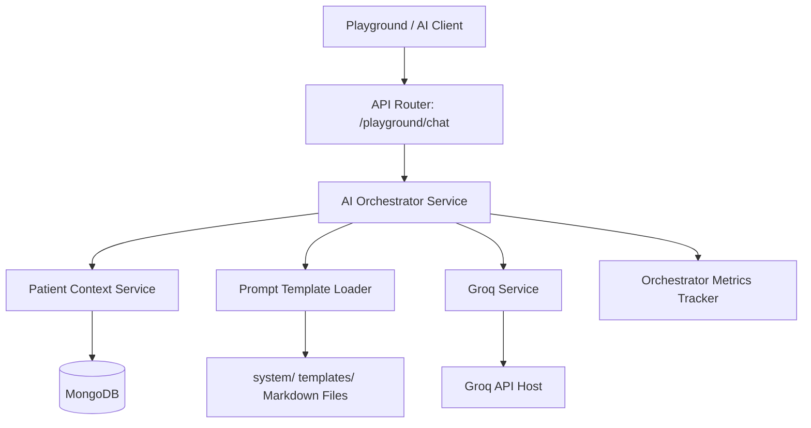

# AI Orchestrator Integration & Infrastructure

This document outlines the AI Orchestration layer implemented in Phase 8 - Sprint 6. The Orchestrator coordinates all platform AI services (Groq LLM, Text Embeddings, Qdrant Vector DB, Patient MongoDB Context, and Prompt Templates) under a single standardized, telemetry-tracked execution pipeline.

---

## Architecture Overview



The `AIOrchestrator` acts as the single point of entry for high-level AI generation tasks. It performs:
1. **Deterministic MongoDB Context Assembly** using `PatientContextService`.
2. **Template Loading and Placeholders Validation** using `PromptLoader` with regex parsing.
3. **Groq Inference Invocation** utilizing prompt variables and system prompts.
4. **Latency, Tokens, Cost Telemetry Tracking** via `OrchestratorMetricsTracker` and structured logging.

---

## 1. Integrated System Health Check

The `/api/v1/ai/playground/health` endpoint verifies connectivity to all integrated infrastructure layers:
- **Groq LLM**: Checks API availability and pings active LLM model.
- **Embeddings**: Pings the local or remote embedding provider.
- **Vector DB**: Performs a ping and retrieves collection lists from Qdrant.
- **Prompt Registry**: Checks the status of registered template markdown files and returns template counts.
- **Context Builder**: Verifies MongoDB read capabilities for patient contexts.

---

## 2. Request Lifecycle & Telemetry

Each execution session generates an `AIExecutionSession` payload and logs detailed execution stats:
- **Trace ID**: A random UUID tracking the session across logs.
- **Duration**: Total processing time in milliseconds.
- **Token Allocation**: Split between input prompts and completion tokens.
- **Cost**: Estimated monetary cost of the execution in USD.

### HIPAA Privacy Constraints
To comply with HIPAA security requirements, the orchestrator telemetry logs only trace IDs, durations, token counts, and costs. **Never** log raw prompts, user queries, medical data, or LLM output completions to console or text logs.

---

## 3. Prompt Placeholders Regex

Standard Python `.format` method throws errors when formatting files containing double curly braces (e.g. JSON templates or mathematical markdown). 
To prevent JSON crashes, the `PromptLoader` uses a negative lookbehind and lookahead regex pattern:
```regex
(?<!\{)\{([a-zA-Z0-9_]+)\}(?!\})
```
This pattern parses `{placeholder}` elements without matching JSON curly braces `{{key: value}}`, allowing safe substitution using `.replace()`.

---

## 4. Retrieval Engine Integration (RAG Foundation)

Phase 9 - Sprint 2 completes the Retrieval Engine foundation:
- **Centralized Retrieval Service**: Vector inquiries are encapsulated in `RetrievalService` preventing direct Qdrant reads in upper workflows.
- **Score Normalization**: Similarity score outputs are normalized to `[0.0, 1.0]` cosine range.
- **Cross-Collection Deduplication**: Multi-collection parallel searches merge results and discard duplicate chunks by `content_hash` tracking, preserving high-scoring results.
- **In-Memory Telemetry**: Retrieval metrics logs track queries count, failures, latencies, averages, deduplication skips, and search timeouts.

