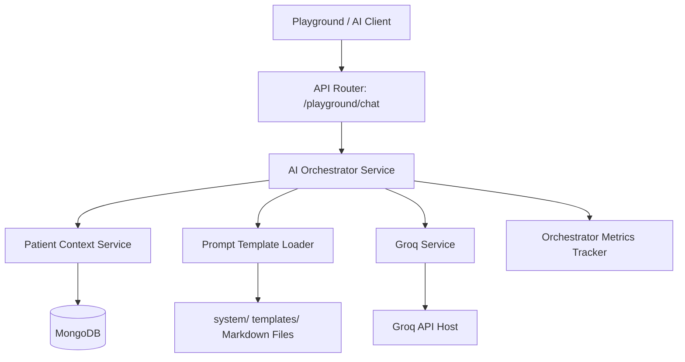

# AI Orchestrator Integration & Infrastructure

This document outlines the AI Orchestration layer implemented in Phase 8 - Sprint 6. The Orchestrator coordinates all platform AI services (Groq LLM, Text Embeddings, Qdrant Vector DB, Patient MongoDB Context, and Prompt Templates) under a single standardized, telemetry-tracked execution pipeline.

---

## Architecture Overview



The `AIOrchestrator` acts as the single point of entry for high-level AI generation tasks. It performs:
1. **Deterministic MongoDB Context Assembly** using `PatientContextService`.
2. **Template Loading and Placeholders Validation** using `PromptLoader` with regex parsing.
3. **Groq Inference Invocation** utilizing prompt variables and system prompts.
4. **Latency, Tokens, Cost Telemetry Tracking** via `OrchestratorMetricsTracker` and structured logging.

---

## 1. Integrated System Health Check

The `/api/v1/ai/playground/health` endpoint verifies connectivity to all integrated infrastructure layers:
- **Groq LLM**: Checks API availability and pings active LLM model.
- **Embeddings**: Pings the local or remote embedding provider.
- **Vector DB**: Performs a ping and retrieves collection lists from Qdrant.
- **Prompt Registry**: Checks the status of registered template markdown files and returns template counts.
- **Context Builder**: Verifies MongoDB read capabilities for patient contexts.

---

## 2. Request Lifecycle & Telemetry

Each execution session generates an `AIExecutionSession` payload and logs detailed execution stats:
- **Trace ID**: A random UUID tracking the session across logs.
- **Duration**: Total processing time in milliseconds.
- **Token Allocation**: Split between input prompts and completion tokens.
- **Cost**: Estimated monetary cost of the execution in USD.

### HIPAA Privacy Constraints
To comply with HIPAA security requirements, the orchestrator telemetry logs only trace IDs, durations, token counts, and costs. **Never** log raw prompts, user queries, medical data, or LLM output completions to console or text logs.

---

## 3. Prompt Placeholders Regex

Standard Python `.format` method throws errors when formatting files containing double curly braces (e.g. JSON templates or mathematical markdown). 
To prevent JSON crashes, the `PromptLoader` uses a negative lookbehind and lookahead regex pattern:
```regex
(?<!\{)\{([a-zA-Z0-9_]+)\}(?!\})
```
This pattern parses `{placeholder}` elements without matching JSON curly braces `{{key: value}}`, allowing safe substitution using `.replace()`.

---

## 4. Retrieval Engine Integration (RAG Foundation)

Phase 9 - Sprint 2 completes the Retrieval Engine foundation:
- **Centralized Retrieval Service**: Vector inquiries are encapsulated in `RetrievalService` preventing direct Qdrant reads in upper workflows.
- **Score Normalization**: Similarity score outputs are normalized to `[0.0, 1.0]` cosine range.
- **Cross-Collection Deduplication**: Multi-collection parallel searches merge results and discard duplicate chunks by `content_hash` tracking, preserving high-scoring results.
- **In-Memory Telemetry**: Retrieval metrics logs track queries count, failures, latencies, averages, deduplication skips, and search timeouts.

---

## 5. Context Ranking & Assembly Engine

Phase 9 - Sprint 3 completes the Context Ranking & Assembly engine:
- **Centralized Assembly Service**: The `ContextAssemblyService` acts as the single orchestrator that pulls clinical data from MongoDB (using `PatientContextService`) and retrieves semantic vectors from Qdrant (using `RetrievalService`). It merges, ranks, and badges these items into a single context payload.
- **Deterministic Prioritization**: The builder enforces a waterfall-priority list:
  1. `patient_memory` (MongoDB patient profile summary - ALWAYS preserved)
  2. `Reports` (Lab results, diagnostic files)
  3. `Consultations` (Doctor consult logs)
  4. `Prescriptions` (Active medications)
  5. `Medical` (Medical guidelines/knowledge)
  6. `Drug` (Drug safety database)
  7. `Doctor` (Doctor profiles)
  8. `Chat` (Conversational message history)
- **Waterfall Token Compression**: A tokenizer estimates the size of each section. The service iteratively adds sections in order of their priority. If a section would cause the total token count to exceed the configured `token_budget` (e.g. 4000 tokens), it is dropped (or truncated) to guarantee that the LLM is never sent prompts exceeding its context window.
- **Verification Citations**: Each retrieved chunk or medical context record is stamped with a unique citation badge index (e.g. `[1]`, `[2]`). A lookup mapping matches these badges to their source database ID and metadata (like document type, section name, page number), enabling frontend clients to render verifiable source links.
- **Telemetry Monitoring**: Built-in tracking of total assembly executions, token usage efficiency, cache status, and average latencies using `ContextAssemblyMetricsTracker`.

---

## 6. Retrieval Agent & Intent-Based Routing

Phase 9 - Sprint 4 integrates the Agent Framework with the Retrieval Engine to build the Retrieval Agent:
- **Centralized Orchestration**: The `RetrievalAgent` acts as a unified coordinator. It classifies the query's intent, queries target vector collections, merges results, and uses `ContextAssemblyService` to build a token-safe clinical prompt context.
- **Deterministic Intent Classification**: Queries are analyzed by `IntentDetectionService` using regex rules and keywords to classify query intent into categories like:
  - `medical_question` → Queries `medical_knowledge` and `patient_reports`
  - `report_analysis` → Queries `patient_reports`
  - `drug_question` → Queries `drug_knowledge` and `patient_reports`
  - `doctor_recommendation` → Queries `doctor_knowledge`
  - `conversation_recall` → Queries `chat_memory`
  - `general_health` → Queries `medical_knowledge`
- **TTL Caching Layer**: To reduce duplicate vector store operations, a `RetrievalCache` is integrated within the Retrieval Agent. Execution outputs are cached using a composite key `(patient_id, normalized_query, intent)`. Cache bypass is supported for tracing and debugging.

---

## 7. RAG Production Optimization & Evaluation (Phase 9 - Sprint 6)

Phase 9 - Sprint 6 introduces production-grade performance optimization and automated quality evaluation harnesses:
- **Multi-Stage Cache**: Enforces TTL caching across all retrieval levels:
  - **Query Cache**: Caches detected intents (TTL: 30m).
  - **Embedding Cache**: Caches text chunk vectors (TTL: 24h).
  - **Retrieval Cache**: Caches multi-collection queries (TTL: 5m).
  - **Context Cache**: Caches assembled contexts (TTL: 2m).
- **Concurrency & Parallel Searches**: Employs `asyncio.Semaphore(3)` bounds and a `2.0s` wait_for timeout on parallel collection searches to prevent system lockups.
- **Subsystem Circuit Breakers**: Protects external integrations by tracking failures. Trips to OPEN state after 5 failures and returns fallback structures (mock Groq JSON, dummy embeddings, empty Qdrant results).
- **Retrieval Evaluation & Benchmarking**: Evaluates retrieval accuracy parameters (Precision, Recall, Citation Quality, Duplicate Rate, and Context Utilization) and logs reports to MongoDB (`rag_evaluations` and `rag_benchmarks` collections).
- **Admin Dashboard Integration**: The RAG administrator dashboard is redesigned to trace performance metrics, caching statistics, interactive evaluations playground, and benchmarking suite runners.

- **Trace Playground View**: An administrator interface allows running queries in standard mode (cached) and debug mode (bypass cache). It displays step-by-step trace components (intent classification scoring, raw vector hits, ranking scores, final context) alongside latency statistics.


