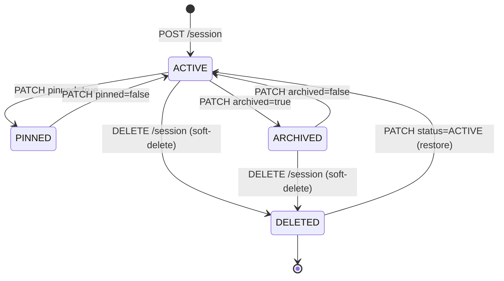

# Chat Infrastructure & Session Management Architecture

This document outlines the database schemas, REST API contracts, lifecycle operations, and the future integration plans for the Nura Conversational AI Platform.

---

## 1. Database Schema

Nura uses MongoDB to store and manage persistent chat conversations and message history. The platform implements two primary collections.

### Collection: `chat_sessions`
Represents a unique conversation channel initiated by a patient.

```json
{
  "_id": "ObjectId",
  "patient_id": "string (User ID)",
  "title": "string",
  "description": "string (optional)",
  "status": "ACTIVE | ARCHIVED | DELETED",
  "session_type": "string (e.g., ai_chat)",
  "active": "boolean",
  "last_message_at": "ISODate",
  "message_count": "int",
  "total_tokens": "int",
  "total_cost": "double",
  "last_agent_used": "string (optional)",
  "pinned": "boolean",
  "archived": "boolean",
  "metadata": "object",
  "created_at": "ISODate",
  "updated_at": "ISODate"
}
```

### Collection: `chat_messages`
Represents individual messages exchanged within a chat session.

```json
{
  "_id": "ObjectId",
  "session_id": "string (Session ID)",
  "patient_id": "string (Patient User ID)",
  "role": "USER | ASSISTANT | SYSTEM",
  "content": "string (message body)",
  "citations": [
    {
      "source": "string",
      "collection": "string",
      "document_id": "string",
      "page_number": "int",
      "score": "double"
    }
  ],
  "attachments": "array",
  "token_usage": {
    "prompt_tokens": "int",
    "completion_tokens": "int",
    "total_tokens": "int"
  },
  "latency_ms": "int (optional)",
  "metadata": "object",
  "created_at": "ISODate",
  "edited_at": "ISODate (optional)",
  "deleted": "boolean"
}
```

---

## 2. REST APIs

All chat endpoints are exposed under `/api/v1/chat`.

### CRUD Session Operations

* **POST `/session`**
  * **Role**: `PATIENT` (must match `patient_id`)
  * **Payload**: `ChatSessionCreate` schema (patient_id, title, description, session_type)
  * **Response**: `SuccessResponse` with `ChatSessionResponse`

* **GET `/sessions`**
  * **Role**: `PATIENT`
  * **Query Parameters**: `limit` (default: 20), `skip` (default: 0), `include_archived` (default: true)
  * **Sorting**: Pinned sessions first, followed by newest based on `last_message_at` descending.
  * **Response**: `SuccessResponse` with an array of `ChatSessionResponse`

* **GET `/session/{session_id}`**
  * **Role**: `PATIENT`
  * **Response**: `SuccessResponse` with `ChatSessionResponse`

* **PATCH `/session/{session_id}`**
  * **Role**: `PATIENT`
  * **Payload**: `ChatSessionUpdate` schema (title, description, pinned, archived, status)
  * **Response**: `SuccessResponse` with updated `ChatSessionResponse`

* **DELETE `/session/{session_id}`**
  * **Role**: `PATIENT`
  * **Behavior**: Soft delete. Updates the session's status to `DELETED` and sets `active` to `false`.
  * **Response**: `SuccessResponse`

---

### Message & History Operations

* **POST `/message`**
  * **Role**: `PATIENT`
  * **Payload**: `ChatMessageCreate` schema (session_id, patient_id, role, content, citations, token_usage, latency_ms, metadata)
  * **Response**: `SuccessResponse` with `ChatMessageResponse`

* **GET `/messages/{session_id}`**
  * **Role**: `PATIENT`
  * **Query Parameters**: `limit` (default: 50), `skip` (default: 0)
  * **Behavior**: Returns non-deleted messages sorted chronologically ascending.
  * **Response**: `SuccessResponse` with `ChatHistoryResponse`

---

### Telemetry Operations

* **GET `/statistics`**
  * **Role**: `ADMIN`
  * **Behavior**: Returns global statistics across all chat sessions and messages.
  * **Response**: `SuccessResponse` with `ChatStatisticsResponse` containing:
    * `sessions_created`
    * `sessions_archived`
    * `sessions_deleted`
    * `messages_created`
    * `messages_edited`
    * `messages_deleted`
    * `average_messages_per_session`

---

## 3. Session Lifecycle State Machine

A chat session moves through several states during its active existence:



---

## 4. Future Streaming & AI Integration Architecture

In subsequent phases, the platform will support Server-Sent Events (SSE) streaming and multi-agent pipeline orchestration.

### Future Architecture Flow

```mermaid
sequenceDiagram
    autonumber
    actor Patient as Patient (UI)
    participant API as FastAPI Router
    participant Orchestrator as Multi-Agent Orchestrator
    participant RAG as Retrieval Agent (Qdrant)
    participant LLM as LLM Engine (Groq)
    participant DB as MongoDB

    Patient->>API: POST /message (role=USER, content="...")
    API->>DB: Save User Message
    API->>Patient: Send SSE Connection Established
    API animate Orchestrator: Trigger AI Pipeline
    Orchestrator->>RAG: Assembles Context (Retrieves records)
    RAG-->>Orchestrator: Assembled Context & Citations
    Orchestrator->>LLM: Stream completion (Structured Prompt)
    LLM-->>API: Stream token chunks
    API-->>Patient: Send chunk (SSE event: message)
    LLM-->>Orchestrator: Stream complete (tokens used, latency)
    Orchestrator->>DB: Save Assistant Message (citations, token_usage, latency)
    Orchestrator->>DB: Update Session stats (count, tokens, cost)
    API-->>Patient: Send SSE close signal
```

### Citations and AI Trace Details
The message metadata field is reserved for embedding:
1. **RAG Citations**: List of document chunks retrieved from the patient's record during query parsing.
2. **Execution Logs**: Performance logs containing latencies for intent routing, vector database lookups, context assembly, and inference execution.
3. **Budget Constraints**: Tracking prompt/completion tokens to enforce per-user usage limits and platform cost control.
