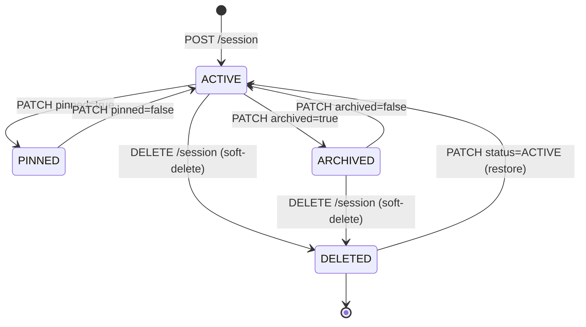
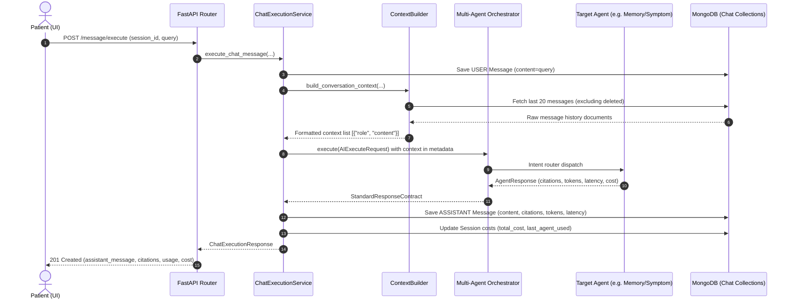
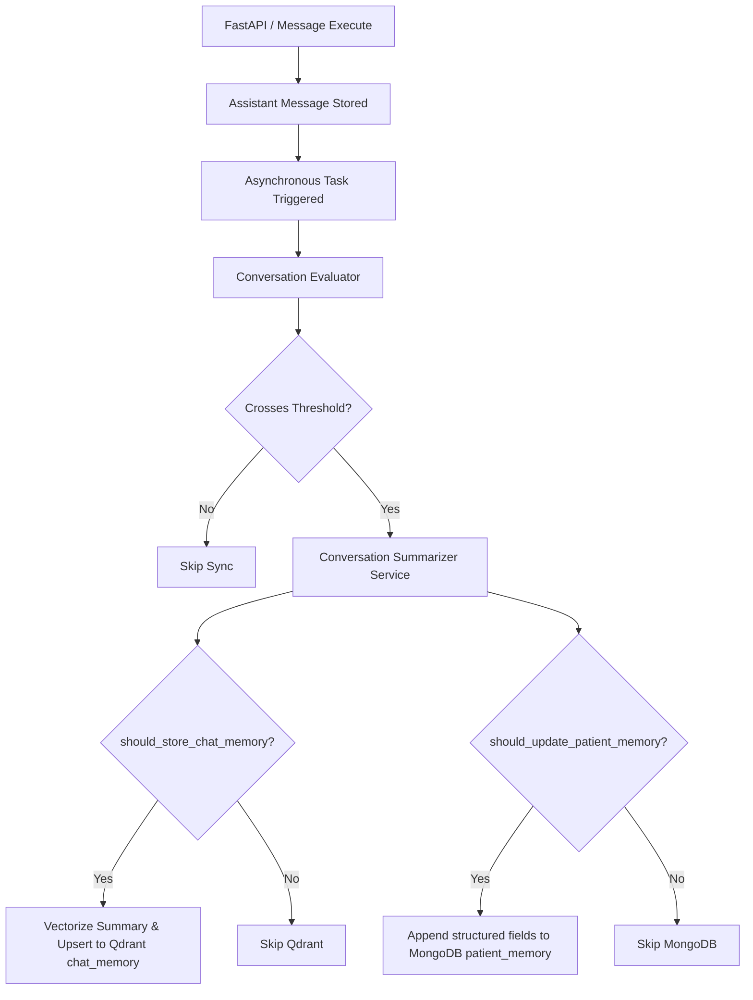
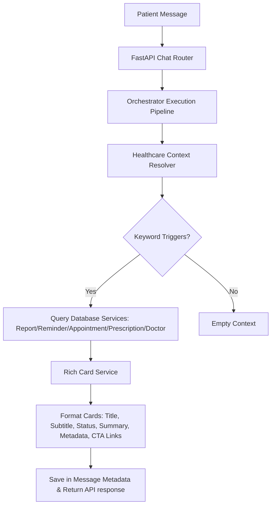

# Chat Infrastructure & Session Management Architecture

This document outlines the database schemas, REST API contracts, lifecycle operations, and the future integration plans for the Nura Conversational AI Platform.

---

## 1. Database Schema

Nura uses MongoDB to store and manage persistent chat conversations and message history. The platform implements two primary collections.

### Collection: `chat_sessions`
Represents a unique conversation channel initiated by a patient.

```json
{
  "_id": "ObjectId",
  "patient_id": "string (User ID)",
  "title": "string",
  "description": "string (optional)",
  "status": "ACTIVE | ARCHIVED | DELETED",
  "session_type": "string (e.g., ai_chat)",
  "active": "boolean",
  "last_message_at": "ISODate",
  "message_count": "int",
  "total_tokens": "int",
  "total_cost": "double",
  "last_agent_used": "string (optional)",
  "pinned": "boolean",
  "archived": "boolean",
  "metadata": "object",
  "created_at": "ISODate",
  "updated_at": "ISODate"
}
```

### Collection: `chat_messages`
Represents individual messages exchanged within a chat session.

```json
{
  "_id": "ObjectId",
  "session_id": "string (Session ID)",
  "patient_id": "string (Patient User ID)",
  "role": "USER | ASSISTANT | SYSTEM",
  "content": "string (message body)",
  "citations": [
    {
      "source": "string",
      "collection": "string",
      "document_id": "string",
      "page_number": "int",
      "score": "double"
    }
  ],
  "attachments": "array",
  "token_usage": {
    "prompt_tokens": "int",
    "completion_tokens": "int",
    "total_tokens": "int"
  },
  "latency_ms": "int (optional)",
  "metadata": "object",
  "created_at": "ISODate",
  "edited_at": "ISODate (optional)",
  "deleted": "boolean"
}
```

---

## 2. REST APIs

All chat endpoints are exposed under `/api/v1/chat`.

### CRUD Session Operations

* **POST `/session`**
  * **Role**: `PATIENT` (must match `patient_id`)
  * **Payload**: `ChatSessionCreate` schema (patient_id, title, description, session_type)
  * **Response**: `SuccessResponse` with `ChatSessionResponse`

* **GET `/sessions`**
  * **Role**: `PATIENT`
  * **Query Parameters**: `limit` (default: 20), `skip` (default: 0), `include_archived` (default: true)
  * **Sorting**: Pinned sessions first, followed by newest based on `last_message_at` descending.
  * **Response**: `SuccessResponse` with an array of `ChatSessionResponse`

* **GET `/session/{session_id}`**
  * **Role**: `PATIENT`
  * **Response**: `SuccessResponse` with `ChatSessionResponse`

* **PATCH `/session/{session_id}`**
  * **Role**: `PATIENT`
  * **Payload**: `ChatSessionUpdate` schema (title, description, pinned, archived, status)
  * **Response**: `SuccessResponse` with updated `ChatSessionResponse`

* **DELETE `/session/{session_id}`**
  * **Role**: `PATIENT`
  * **Behavior**: Soft delete. Updates the session's status to `DELETED` and sets `active` to `false`.
  * **Response**: `SuccessResponse`

---

### Message & History Operations

* **POST `/message`**
  * **Role**: `PATIENT`
  * **Payload**: `ChatMessageCreate` schema (session_id, patient_id, role, content, citations, token_usage, latency_ms, metadata)
  * **Response**: `SuccessResponse` with `ChatMessageResponse`

* **GET `/messages/{session_id}`**
  * **Role**: `PATIENT`
  * **Query Parameters**: `limit` (default: 50), `skip` (default: 0)
  * **Behavior**: Returns non-deleted messages sorted chronologically ascending.
  * **Response**: `SuccessResponse` with `ChatHistoryResponse`

---

### Telemetry Operations

* **GET `/statistics`**
  * **Role**: `ADMIN`
  * **Behavior**: Returns global statistics across all chat sessions and messages.
  * **Response**: `SuccessResponse` with `ChatStatisticsResponse` containing:
    * `sessions_created`
    * `sessions_archived`
    * `sessions_deleted`
    * `messages_created`
    * `messages_edited`
    * `messages_deleted`
    * `average_messages_per_session`

---

## 3. Session Lifecycle State Machine

A chat session moves through several states during its active existence:



---

## 4. Active AI execution Pipeline Architecture

The AI Chat Execution Pipeline links the persistent MongoDB chat storage to the LangGraph Multi-Agent Orchestrator. 

### Sequence Diagram of Chat Execution



---

## 5. Components Details

### 5.1 Context Builder
The `build_conversation_context` utility aggregates the temporal chat history:
* Retrieves the last `limit` messages from `chat_messages` (default limit of 20).
* Translates message schemas: `USER` → `user`, `ASSISTANT` → `assistant`, `SYSTEM` → `system`.
* Appends metadata descriptions at the top of the context window as a `system` instruction.

### 5.2 Error Handling & Resilience
In the event of an orchestrator crash or Groq API failure:
* The user's query remains persisted in the `chat_messages` collection, preserving conversation logs.
* No assistant reply document is created.
* An error response is returned to the user interface, prompting them to retry.

### 5.3 Telemetry Flow
Admin statistics are aggregated on-the-fly directly from MongoDB collections:
* **AI Requests**: Count of assistant messages.
* **Failures**: Real-time counter queried from the thread-safe `MultiAgentTelemetryTracker` singleton.
* **Latency**: Calculated using MongoDB `$avg` pipeline on `$latency_ms`.
* **Token Usage & Costs**: Summarized using MongoDB `$sum` operators on the nested tokens and cost properties.
* **Agent Distribution**: Formed using MongoDB `$group` on `metadata.agent`.

---

## 6. Streaming, Feedback & Intelligence Architecture (Sprint 3)

### 6.1 Server-Sent Events (SSE) Streaming Lifecycle
The streaming execution uses FastAPI's `StreamingResponse` over HTTP. 

1. **Client Request**: Patient triggers message stream via `POST /message/stream`.
2. **Persistence**: The user message is immediately saved to MongoDB.
3. **Execution**: Context is compiled, and the Multi-Agent Orchestrator is executed.
4. **SSE Event Stream**:
   - Yields `type: "token"` events containing partial text chunks.
   - If aborted or disconnected, the stream generator catches `asyncio.CancelledError`, logs it, and cleans up.
   - Once completed, the final assistant response is persisted in `chat_messages` (preventing partial or corrupt message records).
   - Yields a final `type: "metadata"` event containing accumulated token counts, final cost, and retrieved citations.

### 6.2 Response Regeneration Pipeline
Allows patients to regenerate assistant responses without duplicating queries:
1. Locate the latest assistant message and its matching user prompt.
2. Soft-delete the previous assistant message.
3. Offset session aggregates (deducting the soft-deleted message's tokens and cost).
4. Run the orchestrator pipeline on the original user prompt.
5. Save the new assistant message with `replaced_message_id` and an incremented `regeneration_count` inside its metadata.

### 6.3 Decoupled Feedback Storage
To protect message history audits from mutating, ratings and reviews are stored in a standalone collection:

#### Collection: `chat_feedbacks`
```json
{
  "_id": "ObjectId",
  "message_id": "string (Reference to chat_messages)",
  "patient_id": "string",
  "rating": "helpful | unhelpful",
  "comment": "string (optional)",
  "timestamp": "ISODate"
}
```

### 6.4 Citation Formatting
Retrieval Agent matches are normalized into UI-friendly citation responses:
* Maps database `document_id` and `source` parameters.
* Resolves `page` and `section` attributes if present in patient record vectors.
* Forwards vector lookup scores as `confidence` metrics (0.0 to 1.0).

### 6.5 Conversation Intelligence
Suggested prompts and automatic title generation are powered by a lightweight sidecar Groq JSON model:
* Evaluates the first interaction pair.
* Formulates a short (3-5 words) session title, replacing default session titles in MongoDB automatically.
* Returns 3 suggested follow-up prompts shown in the UI as clickable prompt badge buttons.


---

## 7. Memory & Conversation Intelligence Pipeline (Sprint 4)

This layer introduces the conversation memory pipeline responsible for scoring, summarization, and synchronization.

### 7.1 Memory Flow Sequence



### 7.2 Scoring & Worthiness Evaluation
Calculations are executed in the deterministic `memory_rules.py` engine based on clinical keywords (symptoms, medications, allergies, diagnoses, lifestyle commitments, follow-up recommendations):
* **`semantic_score`**: Detailed exchanges, preferences, and long messages increase semantic score. Max value: 1.0.
* **`clinical_score`**: Occurrence of clinical pattern indicator keywords increases clinical score. Max value: 1.0.
* **`memory_score`**: Average of semantic, clinical, and quality score variables.
* **`should_store_chat_memory`**: Set to `True` if `semantic_score >= 0.5`.
* **`should_update_patient_memory`**: Set to `True` if `clinical_score >= 0.6`.

### 7.3 Qdrant Vectors: `chat_memory`
The RAG-optimized conversation summary text, extracted keywords, clinical entities, and session details are vectorized (L2 normalized dimension list) and indexed in the Qdrant `chat_memory` collection.

### 7.4 MongoDB Documents: `patient_memory`
When clinical threshold is crossed, structured medical parameters are appended to the longitudinal patient record.
* **History Logs**: Chronological medication and diagnosis details are appended to medication/diagnosis histories without overwriting previous updates.
* **Concatenation**: Lifestyle recommendations are appended to the patient's lifestyle notes.


---

## 8. Healthcare Integrations & Rich Cards (Sprint 6)

Sprint 6 bridges the Conversational Chat Platform with Nura's healthcare dashboard modules (reports, medications, reminders, appointments, doctors, laboratory values, risk analysis, drug safety) by parsing conversation context and embedding rich interactive UI cards directly below message bubbles.

### 8.1 Integration Flow & Services Architecture



### 8.2 Resolved Healthcare Modules & Card Schemas

1. **Reports Card**: Triggered by keywords like `report`, `ocr`, `upload`. Details include OCR document classification, AI clinical summary, risk levels, and actions to `OPEN_REPORT` or `DOWNLOAD_REPORT`.
2. **Medications Card**: Triggered by keywords like `medicine`, `prescription`, `medication`. Details include drug name, dosage, frequency, and actions to view medications and check safety.
3. **Drug Safety Card**: Triggered by keywords like `safety`, `interaction`. Displays interaction warnings, severity classification, active interaction counts, and actions to check safety on the dashboard.
4. **Appointment Card**: Triggered by keywords like `appointment`, `visit`, `consult`. Renders doctor consultations, dates/times, status, reason summaries, and actions to book a follow-up.
5. **Reminder Card**: Triggered by keywords like `reminder`, `remind`, `schedule`. Renders configured title, schedule, status, descriptions, and deep-link actions to view reminders.
6. **Doctor Card**: Triggered by keywords like `doctor`, `specialty`. Renders specialization, bio summary, consultation fees, and actions to view profile or book appointments.
7. **Laboratory Card**: Triggered by keywords like `lab`, `value`, `result`, `cholesterol`, `blood test`. Parses laboratory results (test name, value, status, reference range) and deep-links to the full report.
8. **Risk Card**: Triggered by keywords like `risk`, `finding`. Renders risk levels, clinical condition analysis, findings, and deep-links to the risk analysis panel on the dashboard.

### 8.3 Frontend Interactive Actions & Deep Linking

Interactive buttons on cards resolve to standardized relative dashboard URLs using the `DeepLinkService` helper:
* **Report View**: `/dashboard/records/{report_id}`
* **Reminder List**: `/dashboard/reminders`
* **Appointment Scheduling**: `/dashboard/appointments`
* **Practitioner Details**: `/dashboard/doctors/{doctor_id}`
* **Longitudinal Memory & Safety**: `/dashboard/patient`


