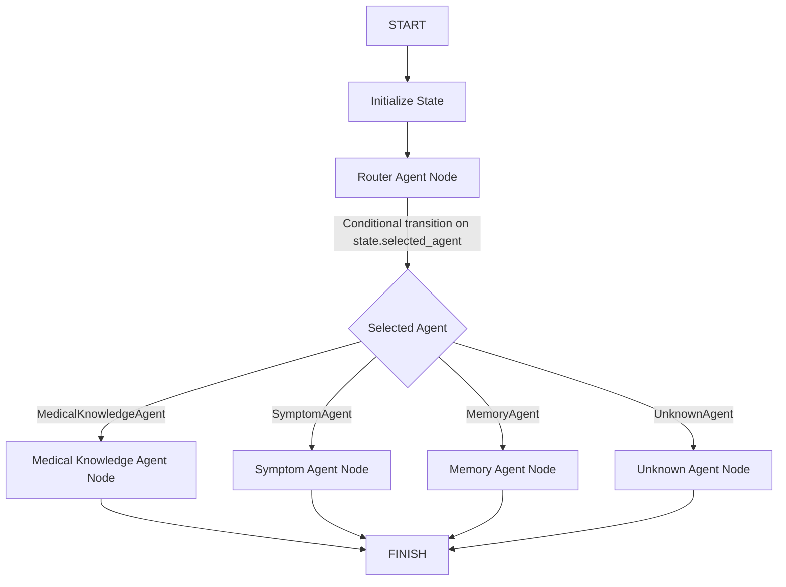

# Core Knowledge Agents

This document details the architecture, design choices, data pipelines, and validation strategies for the first three concrete production-grade agents in the Nura Healthcare Platform orchestration layer:
1. **MedicalKnowledgeAgent**
2. **SymptomAgent**
3. **MemoryAgent**

---

## 1. Architectural Architecture & Graph Flow

The execution framework dynamically dispatches execution using the Node Registry and state conditional transitions inside the LangGraph orchestrator:

---

## 2. Agent Responsibilities & Safety Rules

### MedicalKnowledgeAgent
- **Responsibility**: Answer clinical knowledge inquiries using a Retrieval-Augmented Generation (RAG) framework querying medical knowledge collections in Qdrant.
- **Data Grounding**: Answers must rely strictly on retrieved text context snippets to prevent hallucination, attaching inline document citations.
- **Patient Providences**: Merges MongoDB patient medical history context if a `patient_id` parameter is specified in the session state.

### SymptomAgent
- **Responsibility**: Provide safe symptom guidance.
- **Safety Boundaries**:
  - Never diagnose the patient.
  - Never prescribe specific drugs.
  - Always output an informational disclaimer notice: *"This symptom summary is for informational purposes only and is not a substitute for professional medical advice, diagnosis, or treatment."*
  - Identify life-threatening red flags (e.g. chest pain, numbness, sudden breathing difficulty) and automatically trigger the `emergency` escalation flag, appending critical instructions to seek immediate emergency care.

### MemoryAgent
- **Responsibility**: Manage conversational sessions history and longitudinal patient memory records.
- **Event-Driven Synchronization**: Updates to patient longitudinal profiles are processed by invoking `MemorySyncService.sync_patient`, which compiles database inputs, extracts insights, and regenerates vector indexes. Never writes directly to Qdrant.

---

## 3. Telemetry Tracking
Telemetry metrics are accumulated in a thread-safe singleton manager (`CoreAgentsTelemetryTracker`) separately per agent, exposing:
- Total execution count
- Average roundtrip latency
- Average token usage (prompt, completion, total)
- Calculated cost estimates
- Specific Qdrant retrieval and Groq API latency metrics

---

## 4. REST Testing Endpoints
Guarded with Administrative Role RBAC, developers can inspect agent behavior:
- `POST /api/v1/ai/agents/medical/test` -> runs MedicalKnowledgeAgent directly
- `POST /api/v1/ai/agents/symptom/test` -> runs SymptomAgent directly
- `POST /api/v1/ai/agents/memory/test` -> runs MemoryAgent directly
- `GET /api/v1/ai/agents/statistics` -> returns all accumulated telemetry
