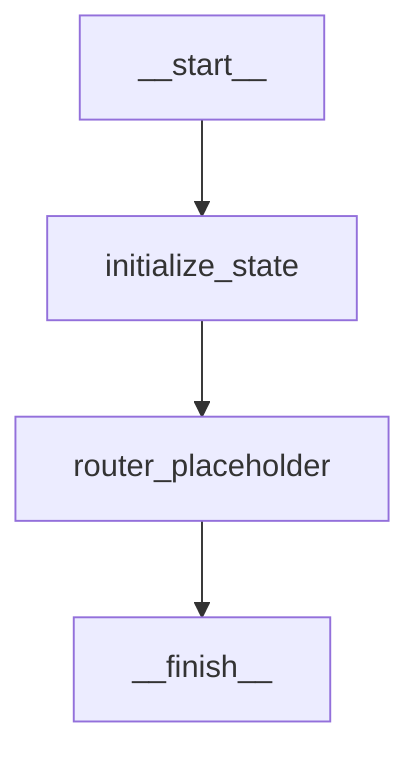

# LangGraph Execution Orchestration Engine

This document details the architecture, design, and integration guidelines for Nura's stateful LangGraph-based AI workflow execution engine. 

---

## Architecture Overview

The orchestration engine serves as the single unified entry point for all AI capabilities in Nura. Workflows are structured as stateful directed graphs where each execution step is represented by a **Node** and transitions between steps are governed by **Transitions**.



### Components Mappings
- **`GraphState`** ([state.py](file:///c:/Users/OM/Desktop/nura/backend/app/graph/state.py)): A strongly typed, Pydantic-validated dictionary container that passes state parameters between execution nodes.
- **`NodeRegistry`** ([registry.py](file:///c:/Users/OM/Desktop/nura/backend/app/graph/registry.py)): A central repository managing the registration of executable callables.
- **`TransitionManager`** ([transitions.py](file:///c:/Users/OM/Desktop/nura/backend/app/graph/transitions.py)): Defines routing rules (normal transitions, conditional transitions based on evaluator callbacks, and terminal boundaries).
- **`GraphBuilder`** ([builder.py](file:///c:/Users/OM/Desktop/nura/backend/app/graph/builder.py)): Links nodes, configures transitions, executes topological BFS validations, and compiles the finalized executable graph instance once.
- **`LangGraphEngine`** ([engine.py](file:///c:/Users/OM/Desktop/nura/backend/app/graph/engine.py)): Async runtime executing state graph paths sequentially. Integrates retries, timeouts, and cancellations.

---

## State Design (`GraphState`)

The shared execution state holds the context of the user interaction and the trace path:

| Field Name | Type | Purpose |
| :--- | :--- | :--- |
| `request_id` | `Optional[str]` | Unique transaction trace ID |
| `session_id` | `Optional[str]` | Chat session identifier |
| `query` | `Optional[str]` | User input query text |
| `detected_intent` | `Optional[str]` | Intent classified for routing |
| `selected_agent` | `Optional[str]` | Designated agent selected for routing |
| `retrieved_context`| `Optional[str]` | Context constructed via RAG |
| `patient_context` | `Optional[str]` | MongoDB longitudinal patient clinical profile |
| `response` | `Optional[str]` | Generated output text |
| `execution_trace` | `List[str]` | Ordered list of node names traversed |
| `execution_time` | `float` | Cumulative processing duration (ms) |
| `error` | `Optional[str]` | Detail message text of exceptions/failures |

---

## Step Execution Lifecycle

When `LangGraphEngine.execute_async(state_dict)` is triggered:
1. **Initialize**: Deserializes state dict into `GraphState`, sets active node index to `__start__`.
2. **Retrieve Node**: Resolves active node callable from the central registry.
3. **Execute Node**: Runs the callable async under `asyncio.timeout(GRAPH_TIMEOUT)`.
   - **Retry Policy**: If the node fails, it is retried up to `GRAPH_MAX_RETRIES` times with exponential backoff.
4. **Merge Updates**: Dict of updates returned by node is merged into `GraphState`.
5. **Next Transition**: Computes target node using `TransitionManager.get_next_node(current_node, state)`.
6. **Telemetry & Tracing**: Logs step execution and path traversals in telemetry maps.
7. **End boundary**: Iteration terminates when next node is `None` or reaches `__finish__`.

---

## Developer Guide: Registering Future Agents & Nodes

To register a new agent or business logic node to the workflow:

### 1. Implement Node Callable
Create a class or async function matching the node callable interface:
```python
# Example: backend/app/agents/symptom_agent.py
from typing import Dict, Any
from app.graph.state import GraphState

class SymptomAnalysisNode:
    async def __call__(self, state: GraphState) -> Dict[str, Any]:
        # 1. Fetch input query
        query = state.query
        
        # 2. Execute agent business logic...
        analysis = "Identified potential mild allergy symptoms based on query."
        
        # 3. Return dictionary of updates to be merged back into GraphState
        return {
            "response": analysis,
            "detected_intent": "symptom_analysis",
            "metadata": {**state.metadata, "symptom_confidence": 0.95}
        }
```

### 2. Register Node & Transition in Bootstrap Loader
Update the lazy-initialization bootstrap hook inside `backend/app/graph/engine.py` (or builder configuration setups):
```diff
# backend/app/graph/engine.py

def get_graph_engine() -> LangGraphEngine:
    global _engine_instance
    if _engine_instance is None:
        builder = get_graph_builder()
        
        # Register standard nodes
        builder.add_node(START_NODE, StartNode())
        builder.add_node(INIT_STATE_NODE, InitializeStateNode())
        
+       # Register the new Symptom Node
+       from app.agents.symptom_agent import SymptomAnalysisNode
+       builder.add_node("symptom_analysis", SymptomAnalysisNode())
        
        builder.add_node(ROUTER_PLACEHOLDER_NODE, RouterPlaceholderNode())
        builder.add_node(FINISH_NODE, FinishNode())
        
        # Define transitions linkages
        builder.add_transition(START_NODE, INIT_STATE_NODE)
-       builder.add_transition(INIT_STATE_NODE, ROUTER_PLACEHOLDER_NODE)
+       
+       # Add conditional transition rule mapping from INIT_STATE
+       def route_intent_condition(state: GraphState) -> str:
+           if state.query and "symptom" in state.query.lower():
+               return "symptom"
+           return "default"
+           
+       builder.add_conditional_transition(
+           INIT_STATE_NODE,
+           route_intent_condition,
+           {"symptom": "symptom_analysis", "default": ROUTER_PLACEHOLDER_NODE}
+       )
+       
+       builder.add_transition("symptom_analysis", FINISH_NODE)
        builder.add_transition(ROUTER_PLACEHOLDER_NODE, FINISH_NODE)
        
        _engine_instance = builder.compile()
    return _engine_instance
```

### 3. Verify Graph Compiled Status
Verify the dashboard visualizes the new nodes and transitions on the **Workflow Engine** tab under the Admin console:
1. Ensure the node is visible in the **Registered Nodes Directory**.
2. Run custom input queries on the **Sandbox Console** to trace step transitions.
3. Assert unit tests verify connectivity.
