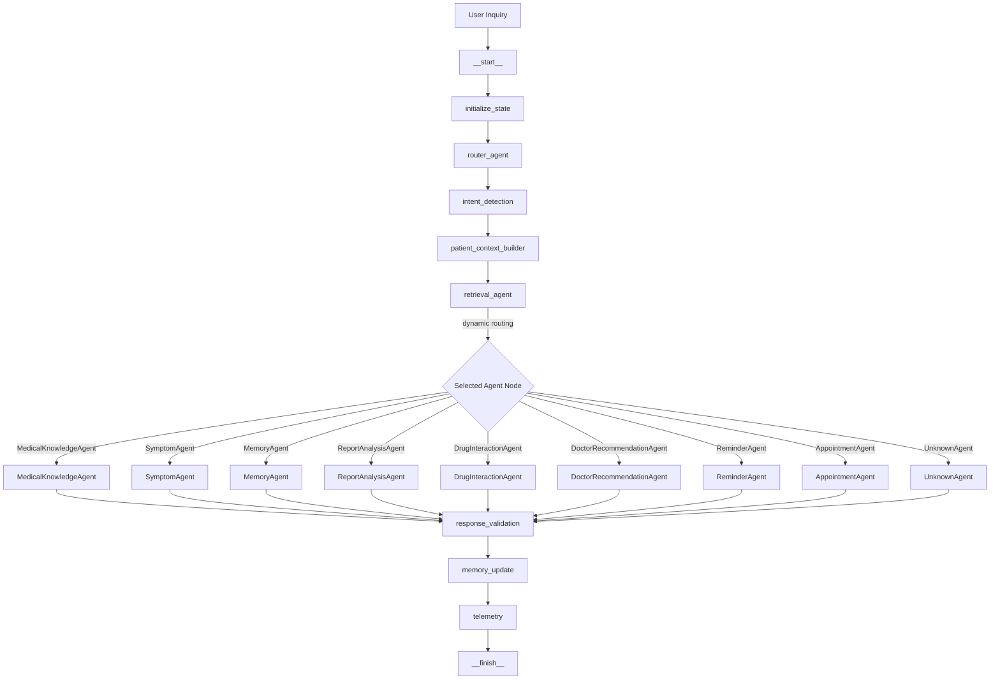

# Multi-Agent Orchestration & End-to-End Workflow

This document details the design, state management, execution traversal path, telemetry gathering, and recovery strategies of the Nura platform's unified Multi-Agent Orchestrator.

---

## 1. Graph Architecture & Workflow Lifecycle

All patient and administrative queries pass through a single compiled LangGraph execution DAG. Routing is dynamic and structured sequentially using helper infrastructure nodes.

### Trace Traversal Diagram


### Nodes Traversal Actions
1. **Initialize State**: Populates request IDs, session tags, and sets initialization start timestamp in metadata.
2. **Router Agent**: Invokes Router agent to classify intent and map the target agent.
3. **Intent Detection**: Traverses intent classification.
4. **Patient Context Builder**: Compiles longitudinal clinical profiles (allergies, medications, conditions) dynamically from MongoDB if `patient_id` context exists.
5. **Retrieval Agent**: Performs semantic vector searches in Qdrant if a query is present.
6. **Selected Agent**: Executes the mapped agent.
7. **Response Validation**: Validates the selected agent outputs and implements graceful fallbacks if errors occur.
8. **Memory Update**: Automatically triggers the Phase 9 patient incremental memory synchronization pipeline to sync clinical updates to Mongo and Qdrant.
9. **Telemetry**: Thread-safely records executions, tokens, cost, cache-hits, and latency counters.
10. **Finish Node**: Compiles response metrics and returns standard output schemas.

---

## 2. Standardized Response Contract

Every workflow execution returns the same standardized response schema structure:

```json
{
  "success": true,
  "agent": "MedicalKnowledgeAgent",
  "intent": "MEDICAL_KNOWLEDGE",
  "response": "Answer text content...",
  "citations": [
    {
      "source": "knowledge_source",
      "text": "Extracted reference chunk text...",
      "score": 0.95
    }
  ],
  "metadata": {},
  "usage": {
    "prompt_tokens": 150,
    "completion_tokens": 120,
    "total_tokens": 270
  },
  "execution_trace": [
    "__start__",
    "initialize_state",
    "router_agent",
    "intent_detection",
    "patient_context_builder",
    "retrieval_agent",
    "MedicalKnowledgeAgent",
    "response_validation",
    "memory_update",
    "telemetry",
    "__finish__"
  ],
  "execution_time": 2450.5,
  "cost": 0.00045,
  "warnings": []
}
```

---

## 3. Incremental Memory Synchronization Integration

After successful executions of agents that mutate records or generate critical logs (`ReportAnalysisAgent`, `ReminderAgent`, `AppointmentAgent`, or important medical conversations), the `MemoryUpdateNode` calls the Phase 9 `MemorySyncService.sync_patient()`. This synchronizes MongoDB updates to Qdrant vector spaces, preserving the longitudinal patient history.

---

## 4. Error Recovery & Retries

The orchestrator includes:
- **Exponential Backoff Retries**: Transient failures (like Groq API limits or rate-limiting delays) are retried at the node boundary with backoffs.
- **Graceful Fallbacks**: If a subsystem (like Qdrant or Groq) times out completely, the `ResponseValidationNode` catches the exception and returns a structured fallback response rather than letting the execution crash.
- **Fail-safe Boundaries**: Errors inside the graph are caught and tracked in the trace output context.
