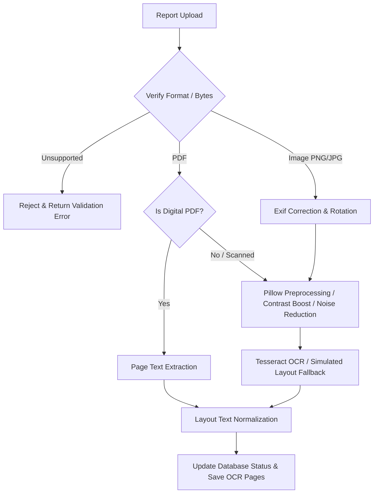

# OCR & Document Processing Pipeline Documentation

The document ingestion pipeline processes patient uploaded medical reports (PDF, PNG, JPG, JPEG) to extract high-quality raw and normalized texts, keeping track of page structures and processing metadata.

## Document Ingestion Flow Chart

## Component Architecture

1. **`PDFExtractor`**:
   - Parses digital selectable text from PDFs.
   - Detects layout boundaries page-by-page.
   - Categorizes page as scanned if character count is lower than 50 characters.

2. **`ImagePreprocessor`**:
   - Rotates image using EXIF metadata parameters.
   - Performs noise reduction filter (Pillow `MedianFilter`).
   - Normalizes image scale parameters (resamples small images up to standard size).
   - Detects blank pages using pixel variance standard deviation computation.

3. **`OCRService`**:
   - Performs OCR on images.
   - Employs a thread pool executor for blocking `pytesseract` operations.
   - Falls back gracefully to high-quality simulated layout text generator if system Tesseract binary is unreachable, which ensures high reliability across environments.

4. **`DocumentParser`**:
   - Master pipeline coordinator class.
   - Resolves formats, invokes extractors and preprocessors, cleans text, and updates database documents.

## REST API Router

- `POST /api/v1/reports`: Upload a document file and queue OCR task.
- `GET /api/v1/reports`: List reports (restricted by role permissions).
- `DELETE /api/v1/reports/{report_id}`: Purge report and local files.
- `POST /api/v1/reports/{report_id}/process`: Request manual OCR re-runs.
- `GET /api/v1/reports/{report_id}/processing-status`: Check active queue logs.
- `GET /api/v1/reports/{report_id}/ocr`: Fetch page breakdown data.
- `GET /api/v1/reports/telemetry/statistics`: Retrieve cumulated telemetry logs (Admin only).
