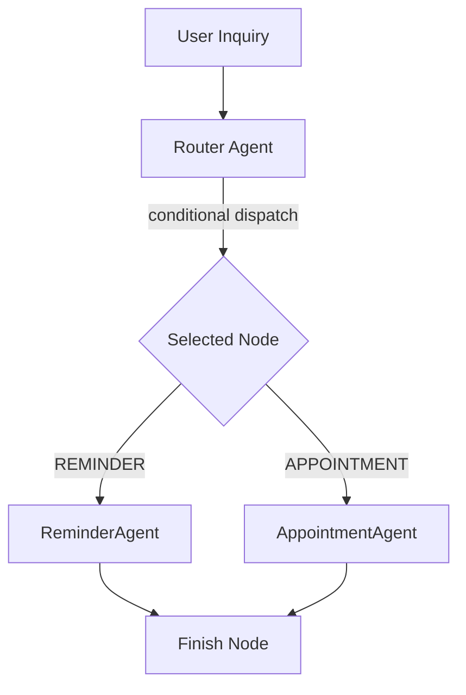

# Operational Healthcare Agents - Technical Documentation

This documentation details the architecture, execution lifecycle, routing constraints, safety rules, and service integrations for the operational healthcare agents in the Nura Platform: **ReminderAgent** and **AppointmentAgent**.

---

## 1. Workflows & Intent Classification

Operational agents differ from medical knowledge query agents by triggering database and state transitions (write operations) rather than just retrieving reference data.

### Intents Routing Registry
- `REMINDER` ➔ Routed to `ReminderAgent`
- `APPOINTMENT` ➔ Routed to `AppointmentAgent`

Intents are classified deterministically in the router using keyword matching, regex weight rules, or dynamically dispatched to graph execution paths using conditional routing transitions.

---

## 2. Reminder Agent (`ReminderAgent`)

### Capabilities
- **Create Medication Reminder**: Validates medication safety, triggers interaction warnings, and inserts a calendar alarm.
- **Create Appointment Reminder**: Automatically creates notification prompts matching a patient's booking date.
- **Create Custom Reminder**: Supports custom alarms (e.g. tracking blood pressure, drinking water).
- **Update Reminder**: Modifies times, descriptions, and recurrences.
- **Delete Reminder**: Removes reminder schedules permanently.
- **Complete Reminder**: Marks reminders as completed/taken.
- **Explain Schedule**: Describes patient active schedules.

### Safety Verification Rules
For medication schedules:
1. Programmatically queries the `DrugInteractionAgent` to identify potential interactions.
2. Aborts creation if conflict severity is `HIGH` or `CRITICAL`.
3. Injects alerts into responses for `LOW` or `MEDIUM` risks, but permits scheduling.

---

## 3. Appointment Agent (`AppointmentAgent`)

### Capabilities
- **Search Doctors**: Finds verified doctor profiles matching specialization.
- **Recommend Slots**: Queries active calendar slots for booking recommendations.
- **Book Appointment**: Resolves slot availability locks and inserts a pending request.
- **Reschedule Appointment**: Choreographs the cancellation of the original appointment slot and booking of the new selection.
- **Cancel Appointment**: Re-opens slot availabilities and updates booking status to `"cancelled"`.
- **Explain Status**: Reviews patient booking histories.

---

## 4. LangGraph Transition Model

---

## 5. Telemetry Tracking
Telemetry metrics are recorded thread-safely in the background:
- **Execution Counters**: Success vs failures rates.
- **Latency Tracking**: Latency milliseconds for agent analysis.
- **Downstream Calls**: Service dependency request counts.
- **Estimated Cost & Tokens**: Track prompt/completion counts and cost estimate.
