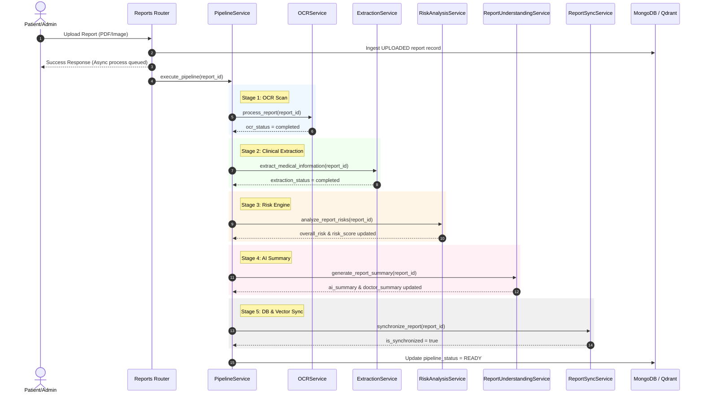

# Report Processing Pipeline Orchestrator

The Nura Report Processing Pipeline coordinates clinical ingestion, OCR processing, structured data extraction, clinical risk scoring, AI summarization, and vector database synchronization into a single, cohesive, transaction-safe workflow.

---

## 1. System Architecture

The pipeline orchestrator acts as a single-entry controller (`PipelineService`) coordinating multiple autonomous micro-services.

---

## 2. Pipeline Status Lifecycle

Reports progress through the following status states during execution:

* **`UPLOADED`**: Report file successfully saved on disk; database record initialized.
* **`PROCESSING`**: Report pipeline currently executing.
* **`OCR_COMPLETE`**: Document parsed; digital page text extracted.
* **`EXTRACTION_COMPLETE`**: Diagnostic parameters, medications, and allergies structured.
* **`RISK_COMPLETE`**: Severity scoring and recommendations completed.
* **`SUMMARY_COMPLETE`**: Executive longitudinal summaries generated.
* **`SYNC_COMPLETE`**: MongoDB patient memory logs and Qdrant points updated.
* **`READY`**: Post-execution validator confirmed total synchronization alignment.
* **`FAILED`**: Execution halted due to terminal stage failures.
* **`PARTIAL_SUCCESS`**: Pipeline finished, but indexing validation found minor structural warnings.

---

## 3. Retry Strategy & Failure Recovery

The orchestrator guarantees high reliability using two retry strategies:

1. **Stage-level Retry with Exponential Backoff**:
   - Each individual stage (OCR, Extraction, etc.) retries up to 3 times internally.
   - Retries apply exponential backoff (e.g. 1s -> 2s -> 4s) to wait for transient external failures.
2. **Partial Recovery & Resumption**:
   - If a stage fails Terminally (depleting its retries), the pipeline is marked as `FAILED`.
   - Admin/Developer can invoke `POST /reports/{report_id}/pipeline/retry`.
   - The orchestrator analyzes the database document status keys.
   - Successful stages are skipped (e.g. if `ocr_status == "completed"`, OCR is bypassed).
   - Execution resumes directly at the failed stage, saving LLM tokens and API roundtrips.

---

## 4. Production Telemetry

The `PipelineTelemetry` collects real-time stats stored in MongoDB collections (`pipeline_telemetry` and `pipeline_retries`):
- Stage execution times (OCR, extraction, risk, summary, sync).
- Success and failure rates.
- Processing queue depths.
- Common error messages logged by the orchestrator.
- Health ratings (healthy vs degraded based on error frequency).
