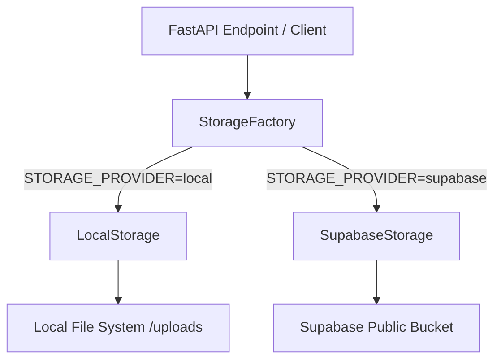

# Storage Architecture

Nura implements a unified production-ready file storage layer to support local filesystem operations (default for development) and Supabase Storage operations (default for production).

## Abstraction Layer

All file upload and delete flows are routed through an abstract base class `StorageProvider` located at [storage_provider.py](file:///c:/Users/OM/Desktop/nura/backend/app/services/storage/storage_provider.py). This prevents the core application routers or services from direct SDK or disk coupling.



## Providers

1. **LocalStorage**:
   - Stores files locally inside `backend/uploads/<bucket>`.
   - Returns public access URLs mapped relative to `settings.BACKEND_URL`.
   - Available automatically without requiring third-party credentials.

2. **SupabaseStorage**:
   - Integrates with the official `supabase` Python library.
   - Automatically validates and ensures the existence of configured storage buckets (`avatars`, `reports`, `doctor-documents`) with public read permissions.
   - Saves objects and returns direct Supabase CDN public URLs.

## Database Schema

MongoDB never stores binary file streams directly. Instead, files are uploaded to the storage provider, and metadata details are stored alongside public URLs.

Example `User` and `Report` MongoDB metadata fields:
```json
{
  "file_url": "https://vdhdwfdrtiipyfuyvdyk.supabase.co/storage/v1/object/public/reports/filename.pdf",
  "file_metadata": {
    "provider": "supabase",
    "bucket": "reports",
    "object_key": "filename.pdf",
    "public_url": "https://vdhdwfdrtiipyvdyk.supabase.co/storage/v1/object/public/reports/filename.pdf",
    "content_type": "application/pdf",
    "size": 1042301
  }
}
```

## Health Monitoring

The System Health check monitors the active storage subsystem:
- Determines settings initialization.
- Validates read/write credentials by performing a mock upload and subsequent deletion on the active provider.
- Reports status to the admin console using the name `Storage`.
