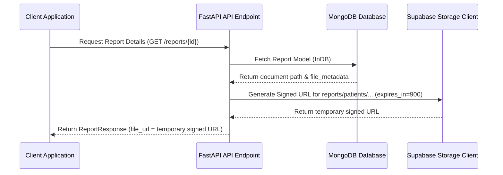

# Storage Architecture & Security Specification

Nura implements a unified production-grade storage abstraction layer designed to support both local filesystem storage (default in development) and Supabase Storage (default in production) without changing frontend API integration or core controller logic.

## 1. Bucket and Path Organization

All assets are structured in deterministic folders depending on their target domain to prevent root-clutter and collisions.

| Bucket | Path/Prefix Format | Visibility / ACL | Usage |
| :--- | :--- | :--- | :--- |
| `avatars` | `users/{user_id}/avatar.webp` | Public Read | User profiles / doctor directory avatars |
| `reports` | `patients/{patient_id}/{report_id}.{ext}` | Private | HIPAA-compliant patient medical reports |
| `doctor-documents` | `doctors/{doctor_id}/{document_type}.{ext}` | Private | Doctor certification/license PDF and images |

---

## 2. Public vs Private Security Model

To protect sensitive patient health details (PHI) and professional credentials:
* **Public Buckets (`avatars`)**: Direct URLs to the assets are stored and accessible publicly from the CDN.
* **Private Buckets (`reports`, `doctor-documents`)**: Direct public access is disabled. Any API response returns a temporary, securely signed URL (expires in 15 minutes) generated dynamically on serialization.

### Signed URL Access Flow



---

## 3. Metadata Schema (`FileMetadata`)

Every uploaded file is indexed inside MongoDB using the shared `FileMetadata` type, tracking the following properties:

```json
{
  "provider": "supabase",
  "bucket": "reports",
  "object_key": "patients/507f1f77bcf86cd799439011/507f1f77bcf86cd799439022.pdf",
  "public_url": null,
  "original_filename": "blood_panel_may2026.pdf",
  "content_type": "application/pdf",
  "size_bytes": 2042104,
  "checksum_sha256": "4b7b3c2...ef902b",
  "uploaded_at": "2026-07-06T10:32:00Z",
  "storage_version": "1.0.0"
}
```

---

## 4. Image Optimization Pipeline

To minimize storage footprints and speed up client load times:
* User profile images are validated to reject files larger than **5 MB**.
* Images are resized using a high-quality lanczos filter to fit within **800px by 800px** while preserving their original aspect ratio.
* Images are automatically converted to the modern, compressed **WebP** format at `80%` quality before upload.

---

## 5. Migration Utility

The migration script [migrate_local_storage_to_supabase.py](file:///c:/Users/OM/Desktop/nura/backend/scripts/migrate_local_storage_to_supabase.py) is a CLI tool designed for zero-downtime operations:
* **Idempotent Execution**: Automatically skips already migrated database records.
* **Integrity Validation**: Computes and matches local SHA-256 checksums against the remote storage instance before concluding the migration.
* **Orphan Rollback**: Deletes newly uploaded files from Supabase if the corresponding database record update fails.
* **Report Generation**: Prints detailed stats showing scanned, skipped, migrated, failed files, and elapsed time.
