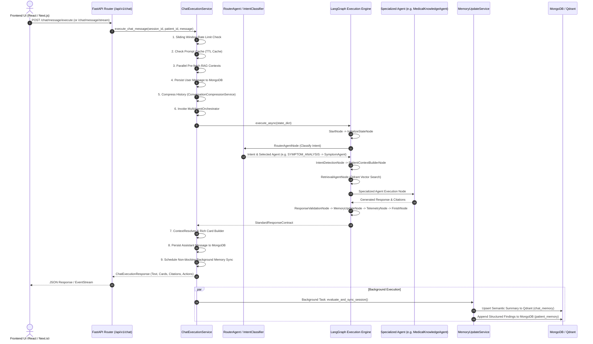

# Nura Chatbot Architecture & System Flow

> **Document Version:** 1.0.0  
> **Last Updated:** August 30, 2026  
> **Status:** Completed Comprehensive Technical Investigation  

---

## 1. Executive Summary

The **Nura Chatbot** is a multi-agent, stateful AI conversational system designed for healthcare interaction. It provides patients with clinical guidance, lab report interpretations, symptom triage, medication interaction checks, appointment scheduling, reminder setups, and conversation history recall.

The system is built on a **LangGraph state machine architecture** integrated with **FastAPI**, **MongoDB**, **Qdrant Vector DB**, and **Groq LLM**. It employs a multi-tiered memory design (working memory, semantic vector memory, and longitudinal patient clinical memory) and a deterministic classification router to dispatch queries to specialized AI agents.

---

## 2. End-to-End Request Execution Flow



---

## 3. Intent Detection & Agent Routing

Intent detection uses a **deterministic keyword and regular expression (regex) weighted scoring algorithm** (`IntentClassifier`) combined with confidence threshold evaluation (`RoutingRulesEvaluator`).

### 3.1 Classification Algorithm
* **Keyword Matching Weight:** `2.0` points per keyword match.
* **Regex Pattern Match Weight:** `5.0` points per pattern match.
* **Confidence Calculation:**
  $$\text{Distinction} = \frac{\text{Winning Score}}{\text{Total Score}}, \quad \text{Strength} = \frac{\text{Winning Score}}{\text{Winning Score} + 3.0}$$
  $$\text{Confidence} = \min(1.0, \, \text{Distinction} \times \text{Strength})$$

### 3.2 Confidence Tiers
* **HIGH Tier ($\ge 0.70$):** Immediate route to mapped agent.
* **MEDIUM Tier ($0.40 - 0.69$):** Route to highest candidate agent with threshold pass tag.
* **LOW Tier ($< 0.40$) / Ambiguous / Unknown:** Route to `UnknownAgent` fallback.

### 3.3 Mapped Intents and Downstream Agents

| Intent Category | Primary Keywords / Patterns | Mapped Agent | Description |
| :--- | :--- | :--- | :--- |
| `GREETING` | hello, hi, hey, good morning, hola | `GreetingAgent` | Handles polite conversational greetings |
| `GENERAL_CHAT` | who are you, what can you do, nura, joke | `GeneralChatAgent` | Handles generic assistant background queries |
| `MEDICAL_QUESTION` | what is, treatment, cure, vaccine, cause, disease | `MedicalKnowledgeAgent` | Answers general medical & clinical queries via RAG |
| `SYMPTOM_ANALYSIS` | headache, fever, cough, chest pain, rash, dizzy | `SymptomAgent` | Performs symptom triage and urgency estimation |
| `REPORT_ANALYSIS` | lab report, blood test, cbc, mri, scan, x-ray | `ReportAnalysisAgent` | Interprets medical lab values & imaging findings |
| `DRUG_INTERACTION` | drug, interaction, dosage, paracetamol, side effect | `DrugInteractionAgent` | Evaluates medication safety & contraindications |
| `DOCTOR_RECOMMENDATION`| recommend doctor, specialist, cardiologist | `DoctorRecommendationAgent` | Recommends relevant doctor specialists |
| `REMINDER` | remind me, schedule med, set alarm, dose time | `ReminderAgent` | Creates/manages patient pill & task reminders |
| `APPOINTMENT` | book appointment, schedule visit, meet doctor | `AppointmentAgent` | Books and manages clinic appointment slots |
| `CONVERSATION_RECALL` | remember, last discussion, previous chat, you said | `MemoryAgent` | Recalls details from earlier chat sessions |
| `UNKNOWN` | Unmatched or ambiguous queries | `UnknownAgent` | Requests query rephrasing gracefully |

> **Note on Dual Intent Services:** A secondary service (`IntentDetectionService` in `app/services/intent_detection_service.py`) operates with 6 broad categories (`medical_question`, `report_analysis`, `drug_question`, `doctor_recommendation`, `conversation_recall`, `general_health`) primarily used for warming parallel vector search caches during pre-retrieval.

---

## 4. Memory Architecture & State Management

The Nura chatbot utilizes a **4-tiered memory framework** to maintain conversation state, token budgets, semantic search capabilities, and longitudinal patient health records.

```
+-----------------------------------------------------------------------------------+
|                            4-TIERED MEMORY FRAMEWORK                              |
+-----------------------------------------------------------------------------------+
| 1. WORKING MEMORY (Sliding Window & Compression)                                  |
|    - Max Token Budget: 8000 tokens                                                |
|    - Retains: Recent 6 messages, bookmarked messages, cited messages, clinical text |
|    - Compresses: Older conversation context into a single system summary block    |
+-----------------------------------------------------------------------------------+
| 2. SEMANTIC VECTOR MEMORY (Qdrant Vector DB)                                     |
|    - Collection: `chat_memory`                                                    |
|    - Evaluated by: `ConversationEvaluator` (Score >= threshold)                  |
|    - Generated by: `ConversationSummaryService` (Summary, Keywords, Entities)    |
|    - Enables: Natural cross-session recall ("What did we discuss about my knees?")|
+-----------------------------------------------------------------------------------+
| 3. LONGITUDINAL CLINICAL PATIENT MEMORY (MongoDB)                                 |
|    - Collection: `patient_memory`                                                 |
|    - Evaluated by: `ConversationEvaluator` (Clinical score >= threshold)         |
|    - Updates: Appends diagnoses, active medications, symptoms, lifestyle notes    |
+-----------------------------------------------------------------------------------+
| 4. PATIENT CONTEXT ASSEMBLY & INJECTION                                           |
|    - Service: `PatientContextService`                                             |
|    - Max Token Budget: 4000 tokens                                                |
|    - Assembles: User profile, clinical memory, lab reports, appointments,         |
|                 prescriptions, consultations, active reminders, health insights   |
+-----------------------------------------------------------------------------------+
```

### 4.1 Memory Evaluation & Update Lifecycle
After a message turn completes:
1. `ConversationEvaluator` scores the session on two metrics: `semantic_score` and `clinical_score`.
2. If `should_store_chat_memory` is true:
   - `ConversationSummaryService` extracts AI summary, key terms, and medical entities.
   - Embeds text via `EmbeddingService` and upserts a vector point into **Qdrant** (`chat_memory` collection).
3. If `should_update_patient_memory` is true:
   - `MemoryUpdateService` appends new medications, diagnoses, and symptoms into the patient's MongoDB `patient_memory` document.

---

## 5. System Features & Infrastructure

* **Rich Card UI Actions:** Resolves healthcare entities to generate interactive rich UI cards (`report`, `medication`, `drug_safety`, `appointment`, `reminder`, `doctor`).
* **Conversation Intelligence:** Automatically generates title names for untitled sessions and suggests 3 contextually relevant follow-up questions (`ConversationIntelligenceService`).
* **Streaming SSE Endpoint:** `/chat/message/stream` streams real-time token chunks to the React frontend (`use-chat.ts` & `fetch` reader).
* **Caching & Rate Limiting:**
  - `RateLimiter`: Sliding window rate limiter per patient ID.
  - `ChatCacheService`: In-memory TTL cache for frequent query responses.

---

## 6. Key Identified Issues & Deficiencies

During our code investigation, several critical flaws were identified that explain why the chatbot is not working properly:

### ❌ Issue 1: Unregistered Agents in LangGraph Engine (Critical Bug)
* **Problem:** In `app/agents/router/intent_registry.py`, `GREETING` maps to `GreetingAgent` and `GENERAL_CHAT` maps to `GeneralChatAgent`. However, inside `app/graph/engine.py` (`get_graph_engine()`), `GreetingAgent` and `GeneralChatAgent` **nodes are NOT registered** in the graph builder or conditional transition map!
* **Impact:** Any user greeting (e.g. "Hello", "Hi Nura") defaults to `UnknownAgent`, causing the AI to respond: *"I'm sorry, I could not classify your query's clinical intent..."*

### ❌ Issue 2: Dual & Discrepant Intent Classifiers
* **Problem:** Two separate intent classifiers exist in the codebase:
  1. `IntentClassifier` in `app/agents/router/intent_classifier.py` (10 categories: `GREETING`, `GENERAL_CHAT`, `MEDICAL_QUESTION`, `SYMPTOM_ANALYSIS`, `REPORT_ANALYSIS`, `DRUG_INTERACTION`, `DOCTOR_RECOMMENDATION`, `REMINDER`, `APPOINTMENT`, `CONVERSATION_RECALL`).
  2. `IntentDetectionService` in `app/services/intent_detection_service.py` (6 categories: `medical_question`, `report_analysis`, `drug_question`, `doctor_recommendation`, `conversation_recall`, `general_health`).
* **Impact:** Inconsistent intent scoring between pre-retrieval context warming and graph routing.

### ❌ Issue 3: Streaming SSE vs Full Execution Pathway Disconnect
* **Problem:** `/chat/message/stream` uses `ChatStreamingService`, which bypasses rich card generation, follow-up suggestions, and background telemetry recording that are otherwise processed in `/chat/message/execute`.
* **Impact:** Users using streaming mode do not receive interactive UI action cards or automated follow-up question chips.

### ❌ Issue 4: Inaccurate Token Heuristic for Context & History Compression
* **Problem:** `ConversationCompressionService` and `PatientContextService` use `len(text) // 4` character estimation for token counting.
* **Impact:** Complex structured JSON context and medical terms exceed actual LLM context window boundaries, leading to truncation or API errors during Groq LLM invocation.

### ❌ Issue 5: Silent Background Memory Sync Failures
* **Problem:** `MemoryUpdateService.evaluate_and_sync_session()` is dispatched via background tasks (`bg_mgr.run_task`). If Qdrant or embedding calls fail, errors are logged but not tracked or retried.

---

## 7. Recommended Improvement Roadmap

When proceeding to the improvement phase, the following steps should be executed:

1. **Register Missing Graph Nodes:** Add `GreetingAgentNode` and `GeneralChatAgentNode` to `app/graph/engine.py` and map them in the conditional transition matrix.
2. **Unify Intent Classification:** Refactor `IntentDetectionService` to wrap `IntentClassifier` so that intent detection is single-sourced across all layers.
3. **Synchronize Streaming with Rich Cards:** Update `ChatStreamingService` to yield metadata events containing generated rich cards and actions upon stream completion.
4. **Implement Precise Token Counting:** Replace `len // 4` with `tiktoken` or accurate tokenizer estimation for context budgets.
5. **Add Retry & Error Handling for Memory Sync:** Implement retry mechanisms for Qdrant vector upserts in `MemoryUpdateService`.
